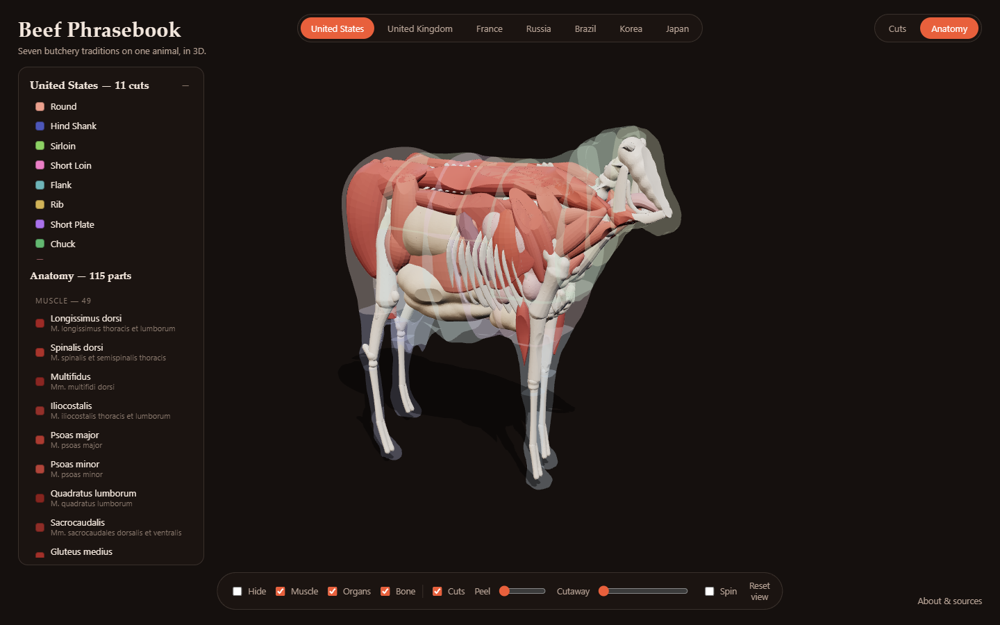
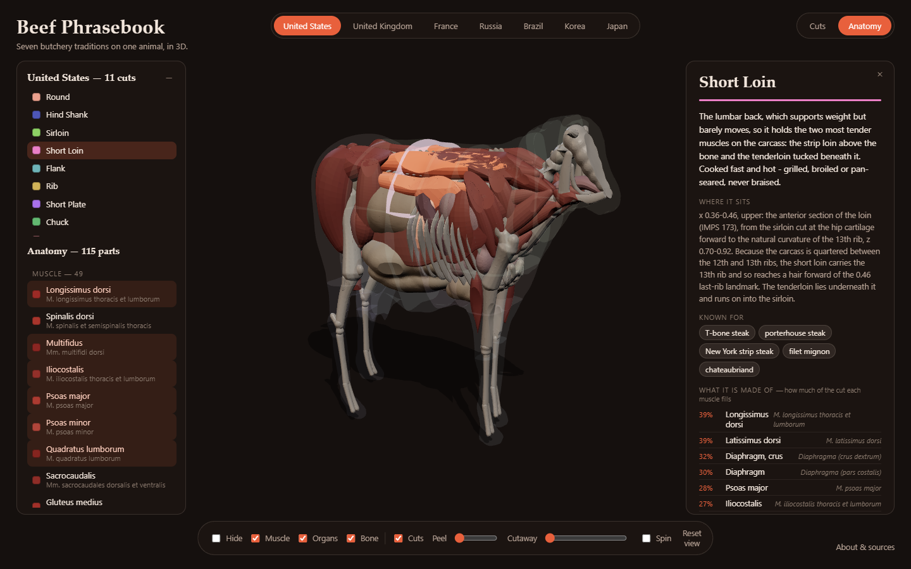

# Beef Phrasebook

**Seven butchery traditions on one animal, in 3D.** An interactive page showing how the
United States, the United Kingdom, France, Russia, Brazil, Korea and Japan divide the same
beef carcass — 153 named cuts drawn on one cow, so the traditions can be compared directly
rather than as seven unrelated charts — over an anatomical model of the same animal, 115
named bones, muscles and organs in the same coordinate frame.

It is a phrasebook rather than a chart because the useful question is not *what are the
American cuts*, it is **what do I ask for over there, and how wrong will it be**. Seven
traditions would need twenty-one translations between them; instead every tradition is
drawn against one shared frame, and the answer is read off the overlap.


### → **[Open it](https://skfd.github.io/beef-phrasebook/)**

**[Read the writeup on how the six traditions differ →](docs/differences.md)**

Pick a cut and the panel tells you what the muscle does on the living animal, how it
is therefore cooked, what it is famous for — and, the part that makes it a phrasebook,
**which cuts occupy that same piece of animal everywhere else**. The US short loin is
91% Russian тонкий край, 82% the British sirloin, 73% Japanese サーロイン, 64% Korean 채끝.
Those numbers are the point: a name table can only say *sirloin ≈ faux-filet*, and a
percentage can say how much that is worth.

It opens on the **animal**: 41 bones, 49 muscles and 25 organs, built in that
same frame, so the short loin lights up the longissimus and the psoas inside it and
the longissimus says which cut it lands in everywhere. The schematic carcass is one
click away under **Cuts** — it is the honest picture of a butchery line, and the
anatomy is the honest picture of what the line goes through.



The chart does not have to stay on the other page either. The **Cuts** layer stands
the tradition on screen around the anatomy as a coloured shell, drawn behind the meat
so that it never veils it, and the culture tabs decide which tradition is standing
there — France's 29 cuts lay a visibly finer lattice over the same animal than
America's 11. Pick a cut, on the shell or in the list beside it, and it closes around
the muscles it is made of while the rest of the carcass fades back:



Peel the superficial muscle away a layer at a time, turn the hide, the organs or the
skeleton off, or open the near side of the animal with the cutaway:


## Running it

It is live at **<https://skfd.github.io/beef-phrasebook/>**, deployed from `web/` by
`.github/workflows/pages.yml` on every push to `main`.

To run it locally: the page is static, but it uses ES modules, which browsers refuse
to load over `file://`, so serve the `web/` folder rather than opening the file:

```sh
cd web && python -m http.server 8731 --bind 127.0.0.1
```

Then open <http://127.0.0.1:8731/>. `three.js` comes from a pinned CDN
(`three@0.186.0`), so the first load needs a network; the models are local.

## Rebuilding the models

Blender is a **portable extract** at `~/Tools/blender-4.5` — it is not on `PATH` and
was never installed machine-wide, so nothing needed a UAC prompt. Add it with
`setx PATH "%PATH%;%USERPROFILE%\Tools\blender-4.5"` if you want `blender` to just work.

```sh
python tools/check_data.py                                   # validate the cut data
python tools/check_anatomy.py                                # validate the anatomy data
~/Tools/blender-4.5/blender.exe -b --python blender/build.py -- --preview
~/Tools/blender-4.5/blender.exe -b --python blender/build_anatomy.py -- --preview
node tools/shoot.js                                          # drive it in Chromium
```

The build takes about three and a half minutes for all seven traditions and writes `web/models/*.glb`,
`web/data/cultures.json` and `build/build_report.json`. `--only us` does one tradition;
`--preview` also renders Workbench PNGs into `build/preview/`.

`build_anatomy.py` is the second model and runs once, not once per tradition — the
animal's insides do not change when the butchery tradition does, which is the whole
point of them. `--only muscle` does one system, `--part longissimus,psoas-major` a
handful of parts, and `--preview` renders **cutaways** with the near half of the hide
booleaned away, because a part is only right or wrong relative to the animal around
it.

`tools/shoot.js` loads the page in real Chromium, hovers and clicks a cut in the 3D
view, explodes the carcass and steps through every tradition, failing on any console
error. A 3D page nobody has rendered is not finished.

## Swapping the cow for a different model

The 130 cut rectangles are authored against the *frame*, not against a particular
mesh, so replacing the animal is a data-free operation:

```sh
blender -b --python blender/import_model.py -- --input your-cow.glb --keep-largest
blender -b --python blender/build.py --            # every tradition, re-carved
```

`import_model.py` reads glb/gltf/obj/fbx/stl/ply/blend, **detects** which way the
animal faces, scales it into the frame, welds it into one manifold shell and writes
`assets/cow_normalized.blend`, which `blender/cow.py` then uses instead of the
procedural cow. Delete that file to go back.

Orientation is detected rather than declared, because a wrong `--forward` flag
produces a cow lying on its side that still exports perfectly happily. For a
standing quadruped the bounding box settles it — longest axis is nose-to-tail,
shortest is across — and the signs have reliable tells: the centroid of a barrel on
thin legs sits above mid-height, and the muzzle end is much narrower than the
buttock. `--forward`/`--up` override it. `--keep-largest` throws away plinths,
ground planes and bystanders.

It then prints where the anatomy actually landed against the FRAME.md landmarks and
**refuses to bless a mesh that fails validation**, because a new model will not have
identical proportions and the cut data assumes those landmarks.

### Finding a model you can actually ship

This repo is public, so the licence has to permit redistribution — "free to
download" usually does not. What the search turned up:

| Source | Licence | Usable? |
|---|---|---|
| [Ungarisches Steppenrind](https://sketchfab.com/3d-models/ungarisches-steppenrind-6c6b19d0a86e472a968c4fbad8a45636), [Pinzgauer Stier](https://sketchfab.com/3d-models/pinzgauer-stier-b6053e511ceb40cc9096aa63f9eebe56) (noe-3d.at) | **CC0** | Scans of 1883 stone bull *statues* in Vienna — sculptural proportions, and the first includes a herdsman. Use `--keep-largest`. |
| [Realistic Holstein Cow](https://sketchfab.com/3d-models/realistic-holstein-cow-game-ready-asset-0bd2f1c0c79a4b5b9d36e67f0f700c5e) (3Dima) | **CC-BY** | 13k faces, game-ready, standing. Best shape match; needs attribution. |
| Poly Pizza, Quaternius, Kenney | CC0 / CC-BY | Stylised low-poly — a downgrade on the procedural cow. |
| TurboSquid / CGTrader / Free3D "free" | Personal-use | **Not redistributable.** Avoid. |

Sketchfab requires a signed-in account to download (the API returns 401 to
anonymous callers), so grabbing one is a browser job. Download it, run the two
commands above, and record the model and its licence in this README plus the page's
About panel if it is CC-BY.

## How it is put together

| Path | What it is |
|---|---|
| `data/FRAME.md` | The normalized cow frame. **Read this first.** |
| `data/cuts_*.json` | One tradition each: names, anatomy, cooking, dishes, sources. |
| `data/composition/COVERAGE.md` | **Can the cuts be rebuilt on muscles? Read this.** |
| `data/composition/*.json` | What each cut is made of: muscles, bone boundaries, sources. |
| `data/anatomy/AUTHORING.md` | How to author a bone, a muscle or an organ. |
| `data/anatomy/*.json` | The skeleton, the musculature and the viscera. |
| `blender/anatomy.py` | Four primitives, the skin clip, and the fit check. |
| `blender/build_anatomy.py` | Builds every part and exports `web/models/anatomy.glb`. |
| `blender/cow.py` | Loads `assets/`, or builds a lofted profile cow if it is absent. |
| `blender/import_model.py` | Fits a downloaded model into the frame, replacing the above. |
| `blender/cuts.py` | Turns hand-drawn rectangles into a true partition of the body. |
| `blender/build.py` | Carves each tradition and exports one GLB per tradition. |
| `web/` | The page. `app.js` is three.js; there is no build step. |
| `tools/` | Data checks, the web data fold-up, the browser test. |

Every cut is expressed as a rectangle in one shared frame — `x` from tail to nose,
`z` from ground to withers — so the *same numbers mean the same place* in all seven
traditions. That shared frame is the whole trick; without it, comparing schemes is
guesswork.

`blender/cuts.py` then resolves those rectangles into a partition before anything is
carved. Rectangle edges become grid lines; the smallest rectangle covering a cell wins
it, so a named subcut (ミスジ, 차돌박이, araignée) beats the primal it sits inside; a
cell inside no rectangle goes to the nearest one, so the legs and head land somewhere
instead of vanishing; and the cells are merged back into as few boxes as possible,
because each one costs a boolean against the whole cow. The result tiles the animal
exactly once — which is what makes per-cut picking and the exploded view work.


## Adding a tradition

1. Write `data/cuts_xx.json` against the schema in the existing files, with every
   rectangle in the frame of `data/FRAME.md`. Cite the URLs you actually fetched.
2. `python tools/check_data.py`
3. Rebuild. Add `xx` to the display order in `tools/make_web_data.py`.

No code changes are needed — the page builds its tabs, legend and cross-references
from the data.

## Honest simplifications

- **Boundaries are axis-aligned blocks.** Real charts have some diagonal and
  seam-following lines. Most beef boundaries genuinely are straight cuts, so this is
  closer than it sounds, but it is an approximation.
- **Thin sheets are carved full width.** Skirt, hanger, flank and the like are sheets
  of muscle, not blocks; carving them true-to-life would make them invisible. The
  panel says so on every cut where it applies.
- **Muscles that differ only left-to-right cannot be separated**, because a cut is a
  rectangle in the side view. French *poire*/*merlan* and the Brazilian round muscles
  are tiled front-to-back instead; the cut descriptions say where they really sit.
- **The cow is a European type, with no hump.** Brazilian *cupim* is the fatty hump of
  zebu cattle; its shape marks the spot but the hump itself is missing, and the panel
  says so.
- **The anatomy is modelled, not scanned.** Every bone, muscle and organ is built
  procedurally from published bovine anatomy against the landmarks in `FRAME.md`: it
  is right about place, proportion and arrangement, and it is not a dissection
  reference. Where a real muscle has heads, aponeuroses and a pennate fibre pattern,
  this one has a spindle with the right origin and insertion.
- **Which cut a muscle lands in is measured, not asserted — but it is measured with
  boxes.** The build records each part's bounding box after carving, and the page runs
  the same rectangle overlap it uses to line one tradition up against another. An 88%
  means "most of this muscle's box is inside that cut's box", not a butcher's judgement.
  Replacing that proxy with real butchery is what `data/composition/` is for: 153 cuts,
  each with the muscles it contains and the bones it stops at, every claim carrying the
  verbatim quote behind it. **102 of the 153 are sourced well enough to be rebuilt on
  muscles today** — see [COVERAGE.md](data/composition/COVERAGE.md) for which, and for
  why the United States turned out to be the hardest to document and the easiest to
  define.

## The anatomy

The second model answers the question the schematic one cannot: what is a ribeye
actually made of. It is authored as data in the same normalized frame, out of four
primitives — a swept polyline, a bowed spindle, an extruded side-view polygon and
fused ellipsoids. [`data/anatomy/AUTHORING.md`](data/anatomy/AUTHORING.md) is the
reference; there is no mesh to edit, so if a part is wrong the numbers are wrong.

The spindle is the thing that makes it read as anatomy rather than as a bag of shapes.
A muscle drawn as a spindle with the right origin, insertion and bow looks like a
muscle. The same muscle drawn as a box looks like the schematic model, which already
exists.

Two checks keep it honest, and both exist because a side render cannot show the
failure. Superficial muscles are intersected with the hide shrunk inward 12 mm,
exactly as `cuts.py` intersects boxes with the body, so the outer layer takes the
animal's real contour instead of bulging through it. And every part reports what
fraction of itself lies outside the hide: a femur poking through an elbow looks fine
from the side and is the first thing you see when the page lets you orbit.

The page shows it with four layer toggles, a peel slider that strips the superficial
muscle away a layer at a time — forty-nine muscles drawn at once is a red blob — and a
cutaway plane that opens the near side of the animal. It is 115 parts and 229k faces,
which is 14 MB raw against about 1.1 MB for a whole tradition's cut model; decimating
it to that size would cost the thing being shown, so it ships Draco-compressed at
4.2 MB and the decoder comes from the same pinned CDN as three.js.

Which half the preview opens matters, because a ruminant is not symmetric inside: the
rumen fills the left of the abdomen and the liver, omasum, abomasum and the whole gut
are on the right. `--cut left|right|both` decides, and `both` is the default.

Two limits of the fit check are worth knowing before you trust it. It runs *after* the
clip, so for a clipped part it is trivially zero and the real failure signal is the
build printing `EMPTY`. And the clip does not trim a badly placed part so much as
delete it: an EXACT boolean against the inset hide returns nothing at all when a part
is substantially outside.

## Two Blender traps, in case they bite again

Both are in `blender/cow.py`'s docstring, and both cost real time here:

- **Metaball resolution and remesh voxel size are absolute lengths.** A cow one unit
  long silently tessellates to an *empty mesh* rather than erroring. Everything is
  built at `SCALE = 10` and shrunk at the end.
- **Metaball fields sum.** Lobes dense enough not to scallop the silhouette balloon
  it; lobes sparse enough to hold it scallop. That is why the body is a loft and not
  metaballs, which was the obvious first choice and the wrong one.

## Attribution and sources

The cow is **["Cow" by nandakishor.irnv](https://sketchfab.com/3d-models/cow-14e616e26823472c809a03042a94b990)**,
used under **[CC BY 4.0](https://creativecommons.org/licenses/by/4.0/)** and modified
(fitted to the frame, made watertight, decimated, carved). See [ATTRIBUTION.md](ATTRIBUTION.md).

Every tradition's data carries the URLs that were actually fetched for it, listed
under **About & sources** in the page and in the `sources` array of each JSON file.
Wikipedia's "Cut of beef" and its per-country counterparts are the backbone, with
USDA IMPS Series 100, AHDB, la-viande.fr, scotconsultoria, 축산물품질평가원 and the
Japan Meat Grading Association behind the individual schemes.
